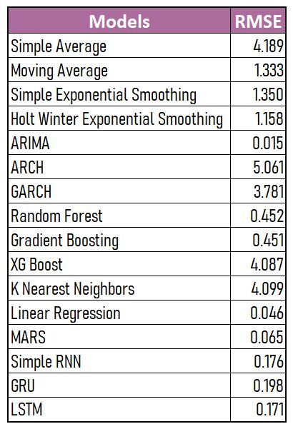
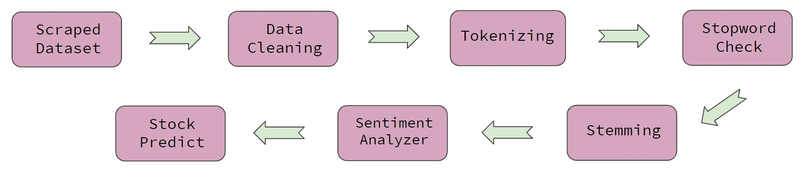
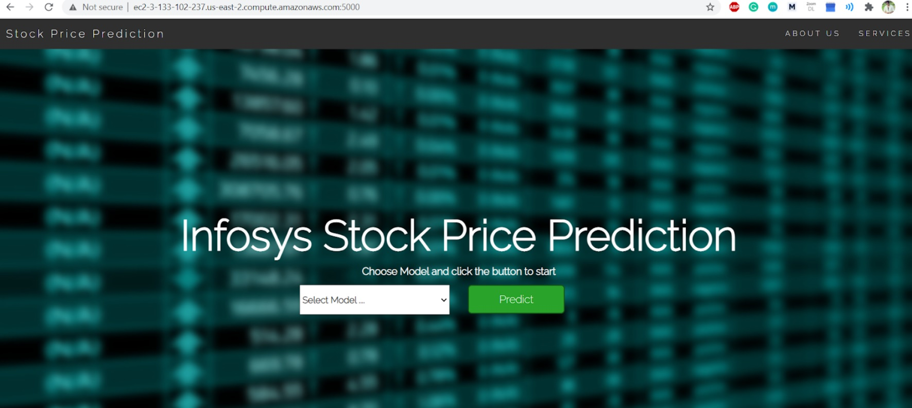
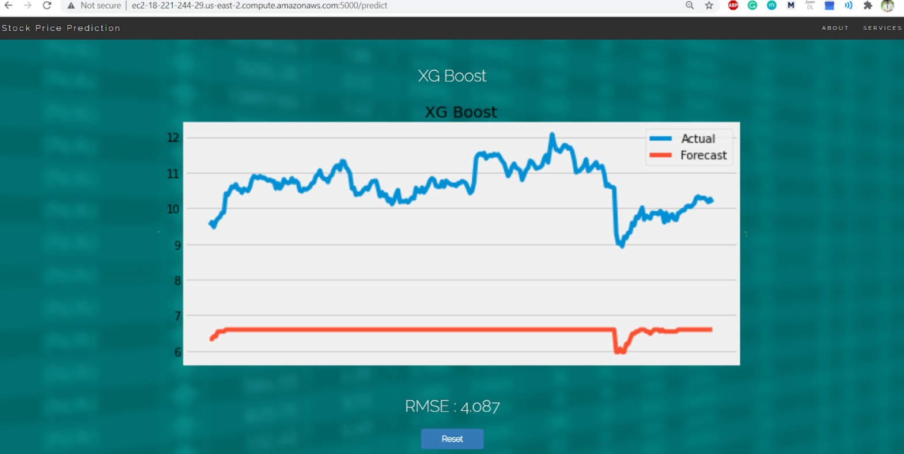

# Stock Market Price Prediction

Objective
-

Predict future value of the stocks of a company in such a way that for a given corpus of fund how one can effectively invest into different sectors by maximizing the profit while minimizing the risk.

Understanding of Time Series, Machine Learning and Deep Learning methodologies for stock prediction and using them to predict on the current values of stocks by training on their previous values.

Files
-

- Project_INFY_TS_Full.ipynb (notebook for TS)
- Project_INFY_ML_Full.ipynb (notebook for ML)
- Project_TS_INFY_DL_Full.ipynb (notebook for DL)
- Project_INFY_NLP_Full.ipynb (notebook for NLP)

Steps Involved
-

- Getting Data
- Time Series Analysis
- Machine Learning Techniques
- Deep Learning Techniques
- Prediction using Sentiment Analysis
- UI Building & Deployment

Working Structure
-

Infosys data was gathered from Yahoo Finance for the years of 2004 to 2019. Data from 2004-2018 was selected as train dataset while data of 2019 was selected for test dataset. 'Return' column was added which had percentage change of Close column.

For **TIME SERIES**, we carried out several methods:

Computed on 'Close' column:
- Simple Average
- Moving Average
- Simple Exponential Smoothing
- Holt Winter Exponential Smoothing

Computed on 'Return' column:
- ARIMA (ADF & KPSS Test were done for stationary check)
- ARCH
- GARCH

For **MACHINE LEARNING REGRESSION** (multivariate), we followed:

- Random Forest
- Gradient Boosting
- XG Boost
- K Nearest Neighbors
- Linear Regression
- MARS

For **MACHINE LEARNING CLASSIFICATION**, positive values of 'Return' was encoded as 1 and negative values was encoded as 0 and those 1 and 0 were stored in a separate column named 'CL'. Pycaret library was run which comprises of all the classifiers so that we can compare output of different classifiers.

For **DEEP LEARNING**, we did prediction on three methods:

- Simple RNN
- GRU
- LSTM

75 days rolling window is used as time step. The model was compiled with the help of Adam optimizer and the error is computed using RMSE. The network is trained for 100 epochs with a batch size of 64. As LSTM gave best result, we used it to forecast price of upcoming 30 days (from Jan 2020) which is not present in dataset.

Here's how all the models performed and it's RMSE scores given:

Regarding **SENTIMENT ANALYSIS**, we used VADER's Sentiment Intensity Analyser library to get the sentiments from the news headlines of INFY. Based on the sentiment scores (positive, negative, neutral) and the 'Close' price, a model was trained on 2009-2016 data using Linear Regression, and prediction was done on 2017-2018 data. Here's the structure used for Prediction using Sentiment Analysis:

Finally a UI was built which gave visualization of how each model performed on the test data of 2019 and it was deployed using Amazon EC2.

About Project
-

This was done as a part of Capstone Project for Praxis Business School. Project members include: Hrisav Bhowmick, Ananda Chatterjee, Avinash Kr Yadav, Sankalpa Saha, Vineet Kumar. The project was done under the guidance of Prof Jaydip Sen.
